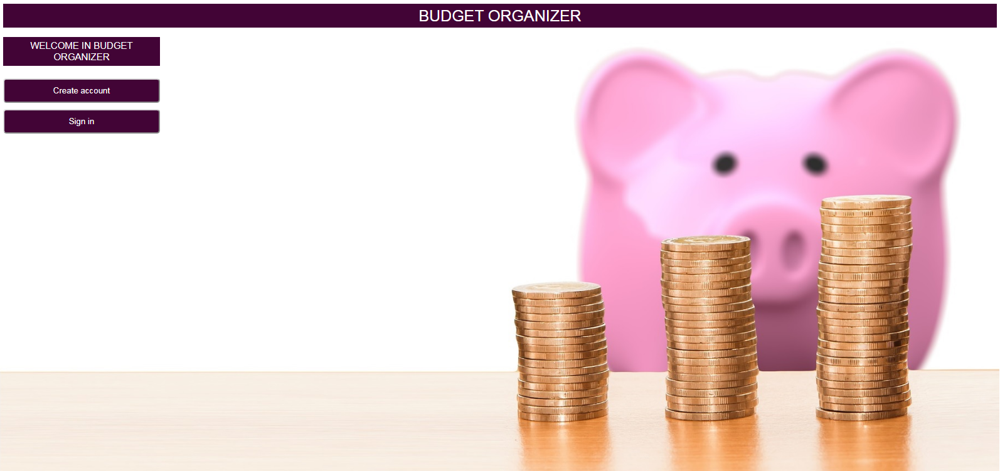
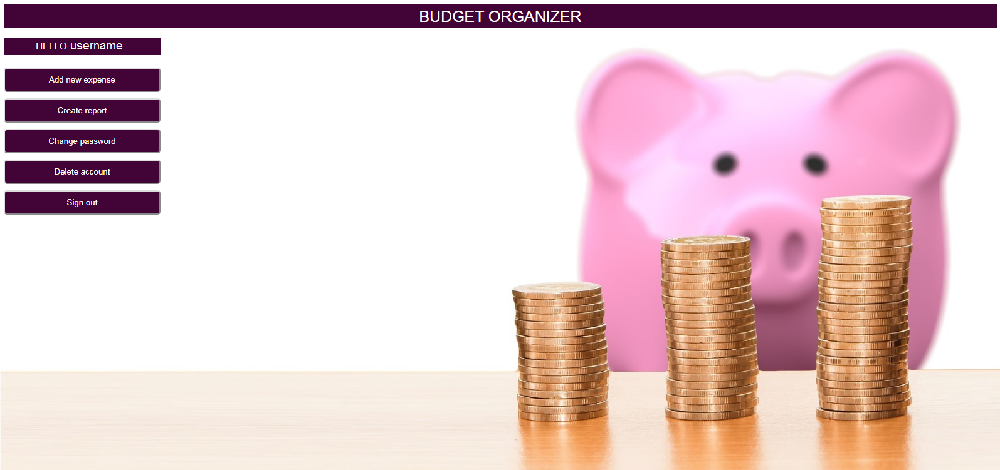
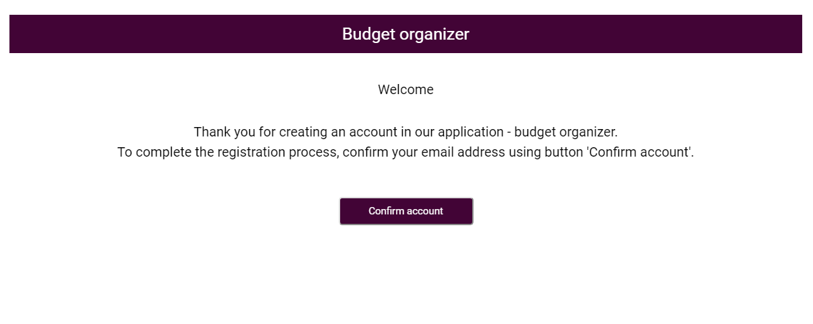
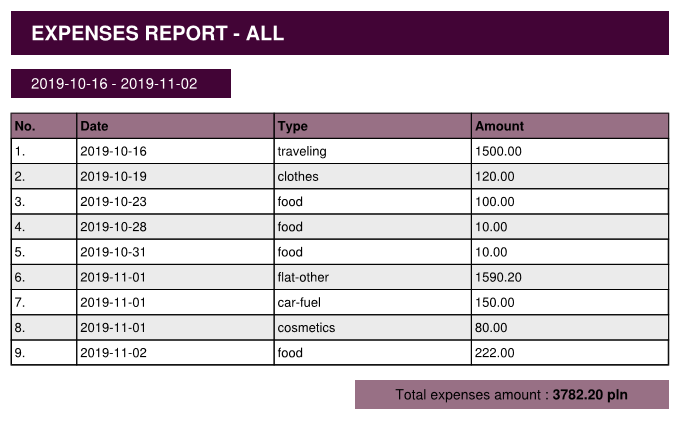

# Budget organizer
> Budget organizer - Simple Web apllication for saving your expenses.

## Technologies
* Java - version 11
* Spring Boot - version 2.1.9
* MongoDB - version 3.8.2
* Thymeleaf - version 3.0.11
* Openhtmltopdf - version 1.0.0
* Mockito - version 3.1.0
* JUnit - version 5.5.2

## Features
* Create account using e-mail address
* Add expences (amount, type, date)
* Generate expenses report - pdf file

## Screenshots

## Status
Project is finished.
